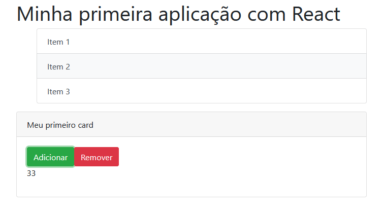

<h2 align="center">Trabalhando com Componentes em React - #DIO</h2>

<p align="center"><a href="https://www.dio.me/">
  </a>
  </p>
  
  <!--ts-->
* [ℹ️ Sobre](#ℹ%EF%B8%8F-sobre)
* [⁉️ Motivo](#%EF%B8%8F-motivo)
* [🌱 Requisitos Mínimos](#-requisitos-mínimos)
* [🚀 Tecnologias Utilizadas](#-tecnologias-utilizadas)
* [🔗 Como executar](#-como-executar)
* [📝 Licença](#-licença)
  <!--te-->

<p align="center">

</p>

## ℹ️ Sobre

Minha primeira aplicação construída em React, uma das principais tecnologias de desenvolvimento Web da atualidade. Seguindo a tutoria da professora da DIO, Nathally Souza ([@nathyts](https://github.com/nathyts)).

Foi explorado conceitos chave como o de Single Page Application (SPA), modularização e, principalmente, boas práticas relacionadas a componentes React.

## ⁉️ Motivo

O curso *Trabalhando com Componentes em React* faz parte do *#[DIO's MRV Bootcamp.](https://web.dio.me/track/mrv-fullstack-developer)*, uma parceria entre [Digital Innovation One](https://github.com/digitalinnovationone), [Orbi Conecta](https://github.com/orbiconecta) e #MRV&CO.

## 🌱 Requisitos Mínimos

[](https://npmjs.com/package/express)

## 🚀 Tecnologias Utilizadas

O projeto foi desenvolvido utilizando as seguintes tecnologias:

- JavaScript
- ReactJS
- ReactDOM
- Bootstrap

## 🔗 Como executar

Para copiar o projeto, utilize os comandos:

```bash
  # Clonar o repositório
  ❯ git clone https://github.com/luandiasrj/Primeira-Aplica-o-em-React.git
  # Entrar no diretório
  ❯ cd react-dio
```
Para instalar as dependências e iniciar o projeto:


**Utilizando Node.JS**

```bash
  # Instalar as dependências
  ❯ npm install
  # Iniciar o projeto
  ❯ npm start
```

## 📝 Licença
<p align="center">
  <a rel="license" href="http://creativecommons.org/licenses/by/4.0/">
  </a>
<br />Este obra está licenciado com uma Licença <a rel="license" href="http://creativecommons.org/licenses/by/4.0/">Creative Commons Atribuição 4.0 Internacional</a>.
  
</p>

* * *
<h4 align="center">
  Feito com ❤️ por luandiasrj 👋️ <a href="mailto:luandias@outlook.com">Entre em contato!</a>
</h4>

<p align="center">
  
<a href="https://www.linkedin.com/in/luan-bernardo-dias"/>
</a>

<a href="https://www.instagram.com/luandiasrj/"/>  
</a>
  
</p>
